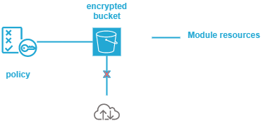

.. image:: docs/imgs/logo.png
   :alt: Logo

==========================
s3 bucket terraform module
==========================

About The Project
=================

This project contains all the infrastructure as code (IaC) to deploy a s3 bucket in AWS

.. image:: https://badgen.net/github/checks/nadegelemperiere-aws/module-aws-bucket
   :target: https://github.com/nadegelemperiere-aws/module-aws-bucket/actions/workflows/release.yml
   :alt: Status
.. image:: https://img.shields.io/static/v1?label=license&message=MIT&color=informational
   :target: ./LICENSE
   :alt: License
.. image:: https://badgen.net/github/commits/nadegelemperiere-aws/module-aws-bucket/main
   :target: https://github.com/nadegelemperiere-aws/module-aws-bucket
   :alt: Commits
.. image:: https://badgen.net/github/last-commit/nadegelemperiere-aws/module-aws-bucket/main
   :target: https://github.com/nadegelemperiere-aws/module-aws-bucket
   :alt: Last commit

Built With
----------

.. image:: https://img.shields.io/static/v1?label=terraform&message=1.6.4&color=informational
   :target: https://www.terraform.io/docs/index.html
   :alt: Terraform
.. image:: https://img.shields.io/static/v1?label=terraform%20AWS%20provider&message=5.26.0&color=informational
   :target: https://registry.terraform.io/providers/hashicorp/aws/latest/docs
   :alt: Terraform AWS provider

Getting Started
===============

Prerequisites
-------------

S3 bucket accesses are logged into another s3 bucket. In order to collect access logs, the logging s3 bucket shall have been declared (using this module for example)

Configuration
-------------

To use this module in a wider terraform deployment, add the module to a terraform deployment using the following module:

.. code:: terraform

    module "bucket" {

        source            = "git::https://github.com/nadegelemperiere-aws/module-aws-bucket?ref=<this module version>"
        project           = the project to which the bucket belongs to be used in naming and tags
        module            = the project module to which the bucket belongs to be used in naming and tags
        email             = the email of the person responsible for the bucket maintainance
        environment       = the type of environment to which the bucket contributes (prod, preprod, staging, sandbox, ...) to be used in naming and tags
        git_version       = the version of the deployment that uses the bucket to be used as tag
        private           = true if the bucket public accesses shall be blocked, false otherwise
        name              = the bucket name
        shall_log_access  = true if the bucket access shall be logged, false otherwise
        logging_bucket    = the identifier of the bucket to use for access logs (optional)
        account           = AWS account to allow access to root by default
        service_principal = technical IAM account used for automation that shall be able to access the bucket
        lifecycles        = [ list of the lifecycles to apply (optional)
            {
                identifier  = Lifecycle identifier
                prefix      = Object prefix to which the lifecycle applies
                transitions = [
                    {
                        days            = Number of storage days after which transition occurs
                        storage_class   = Target storage type for transition
                    }
                ]
                expiration  = {
                    days            = Number of days after which stored objects are destroyed
                }
                noncurrent_version_transitions = [
                    {
                        days            = Number of storage days after which transition occurs
                        number          = Number of versions after which transition occurs
                        storage_class   = Target storage type for transition
                    }
                ]
                noncurrent_version_expiration  = {
                    days            = Number of storage days after which stored objects version are destroyed
                    number          = Number of versions after which stored objects version are destroyed
                }
            }
        ]
        rights         = [ List of rules describing allowed bucket access
           {
                description = Name of the set of rules, type AllowSomebodyToDoSomething
                actions     = [ List of allowed s3 actions, like "s3:PutObject" for example ]
                principal   = {
                    aws            = [ list of roles and/or iam users that are allowed bucket access ]
                    services       = [ List of AWS services that are allowed bucket access ]
                }
                content      = True if the rights does not concern the bucket itself, but its content
            }
        ]
    }

Usage
-----

The module is deployed alongside the module other terraform components, using the classic command lines :

.. code:: bash

    terraform init ...
    terraform plan ...
    terraform apply ...

Detailed design
===============

Bucket is encrypted by design. Public access is blocked by default but can be reactivated if needed.

Bucket policy enables by default :

* The root user of the account

* The IAM user used to perform infrastructure deployment

It also forces object to be encrypted before being put into the bucket

to get full access to the repository, so that it can be fully managed by terraform. Additional rights are provided through module configuration

Testing
=======

Tested With
-----------

.. image:: https://img.shields.io/static/v1?label=technogix_iac_keywords&message=v1.4.0&color=informational
   :target: https://github.com/nadegelemperiere-aws/robotframework
   :alt: Technogix iac keywords
.. image:: https://img.shields.io/static/v1?label=python&message=3.10.5&color=informational
   :target: https://www.python.org
   :alt: Python
.. image:: https://img.shields.io/static/v1?label=robotframework&message=5.0.1&color=informational
   :target: http://robotframework.org/
   :alt: Robotframework
.. image:: https://img.shields.io/static/v1?label=boto3&message=1.24.1&color=informational
   :target: https://boto3.amazonaws.com/v1/documentation/api/latest/index.html
   :alt: Boto3

Environment
-----------

Tests can be executed in an environment :

* in which python and terraform has been installed, by executing the script `scripts/robot.sh`_, or

* in which docker is available, by using the `technogix infrastructure image`_ in its latest version, which already contains python and terraform, by executing the script `scripts/test.sh`_

.. _`technogix infrastructure image`: https://github.com/technogix-images/terraform-python-awscli
.. _`scripts/robot.sh`: scripts/robot.sh
.. _`scripts/test.sh`: scripts/test.sh

Strategy
--------

The test strategy consists in terraforming test infrastructures based on the s3 module and check that the resulting AWS infrastructure matches what is expected.
The tests currently contains 1 test :

1 - A test to check the capability to create multiple s3 buckets

The tests cases :

* Apply terraform to deploy the test infrastructure

* Use specific keywords to model the expected infrastructure in the boto3 format.

* Use shared S3 keywords relying on boto3 to check that the boto3 input matches the expected infrastructure

NB : It is not possible to completely specify the expected infrastructure, since some of the value returned by boto are not known before apply. The comparaison functions checks that all the specified data keys are present in the output, leaving alone the other undefined keys.

Results
-------

The test results for latest release are here_

.. _here: https://nadegelemperiere-aws.github.io/module-aws-bucket/report.html

Issues
======

.. image:: https://img.shields.io/github/issues/nadegelemperiere-aws/module-aws-bucket.svg
   :target: https://github.com/nadegelemperiere-aws/module-aws-bucket/issues
   :alt: Open issues
.. image:: https://img.shields.io/github/issues-closed/nadegelemperiere-aws/module-aws-bucket.svg
   :target: https://github.com/nadegelemperiere-aws/module-aws-bucket/issues
   :alt: Closed issues

Roadmap
=======

N.A.

Contributing
============

.. image:: https://contrib.rocks/image?repo=nadegelemperiere-aws/module-aws-bucket
   :alt: GitHub Contributors Image

We welcome contributions, do not hesitate to contact us if you want to contribute.

License
=======

This code is under MIT License.

Contact
=======

Technogix - contact.technogix@gmail.com

Project Link: `https://github.com/nadegelemperiere-aws/module-aws-bucket`_

.. _`https://github.com/nadegelemperiere-aws/module-aws-bucket`: https://github.com/nadegelemperiere-aws/module-aws-bucket

Acknowledgments
===============

N.A